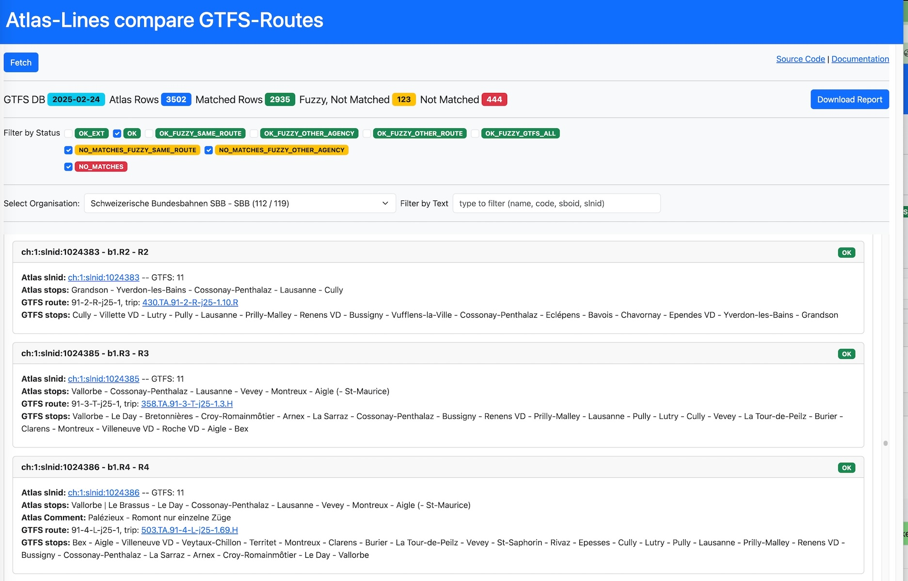
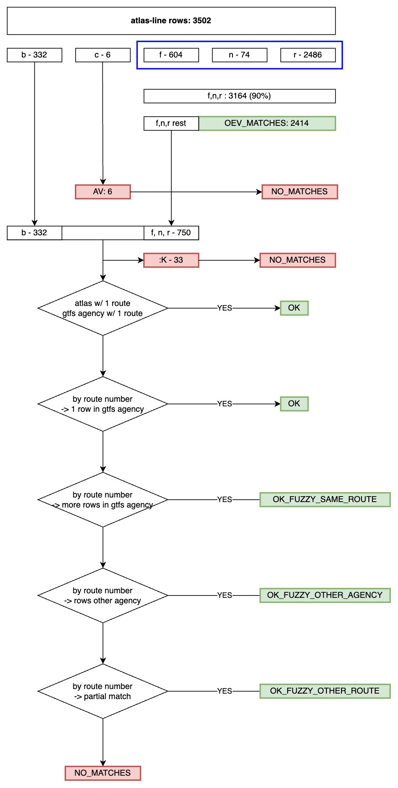

# Atlas-Lines compare GTFS-Routes

URL: https://tools.odpch.ch/atlas-route-compare-gtfs/



This is a Angular web application that compares the [Atlas Line](https://data.opentransportdata.swiss/de/dataset/slnid-line) dataset against [GTFS routes](https://opentransportdata.swiss/en/cookbook/gtfs/). For stop names lookup [Location Information](https://opentransportdata.swiss/en/cookbook/ojplocationinformationrequest/) OJP Service is used. 

## Development

```
$ npm install
$ ng serve
```

## Datasets

| Dataset | Description | URL |
| - | - | - |
| Atlas Line | Latest `actual_date_line_versions` file from [slnid-line](https://data.opentransportdata.swiss/de/dataset/slnid-line) dataset | [actual_date_line_versions_LATEST.csv](https://opentdatach.github.io/data/slnid-line-actual-date/actual-date-line_LATEST.csv) |
| Business Organisations | Latest `full_business_organisation_versions` file from [business-organisations](https://data.opentransportdata.swiss/de/dataset/business-organisations) dataset | [full_business_organisation_versions_LATEST.csv](https://opentdatach.github.io/data/business-organisations/full-business-organisation_LATEST.csv) |
| GTFS catalog | Current imported GTFS datasets using [gtfs-static-db-importer](https://github.com/openTdataCH/showcases/tree/develop/tools/gtfs-static-db-importer) tool | [gtfs-static-dbs.json](https://tools.odpch.ch/gtfs-static-dbs/gtfs-static-dbs.json) |
| GTFS DB Lookups | Given GTFS-day table lookups: `agency`, `routes`, `stops` | [/gtfs-query/db_lookups](https://github.com/openTdataCH/showcases/tree/develop/apps/gtfs-query) `gtfs-query` docs |
| Route Trips | "Representative" GTFS `trips` for each `routes` | [/gtfs-query/query_routes_representative_trip](https://github.com/openTdataCH/showcases/tree/develop/apps/gtfs-query) `gtfs-query` docs |
| Atlas OEV Lines | Generated file from [atlas-lookup-lines](../../tools/atlas-lookup-lines/) tool | [atlas_oev_report.json](https://tools.odpch.ch/data/atlas_oev_report.json) |
| Atlas Stops GeoJSON | Generated file from [atlas-geocode-lines](../../tools/atlas-geocode-lines/) tool | [atlas_stops.geojson](https://tools.odpch.ch/data/atlas_stops.geojson) |

## Process

- `Atlas Line` CSV rows are processed and looked up against `Business Organisations` dataset
- for each `Business Organisations` a GTFS `agency.txt` equivalent is looked-up
- `swissLineNumber` values are parsed and a match with [oev-info.ch](https://www.oev-info.ch/de) dataset is performed
  - this is done in [atlas-lookup-lines](../../tools/atlas-lookup-lines/) tool
  - output is `Atlas OEV Lines` JSOn file containing mapping between `slnid` and gtfs routes/trips matched
- `description` values are extracted in individual stop names which are looked up against [Location Information](https://opentransportdata.swiss/en/cookbook/ojplocationinformationrequest/) OJP Service.
  - this is done in [atlas-geocode-lines](../../tools/atlas-geocode-lines/) tool
  - output is a `Atlas Stops GeoJSON` file containing mapping between `slnid` and stops found
- each `Atlas Line` CSV row is matched against GTFS routes, see `GTFS Lookups` below
  - if there is only 1 GTFS route matching the `agency_id`, `route_short_name` then is kept without any other stop names/location matching
  - same for the Atlas organisation / GTFS agency which have only 1 route
  - if there are more matches then a geo-lookup is performed and kept the routes that have at least 2 stops matching
  - see `GTFS Lookups` and `Matched Status` below for more information about lookup
- a matching CSV report is generated

## Report CSV Rows

### Headers

| Field | Optional | Example | Description |
| - | - | - | - |
| atlas_slnid |  | `ch:1:slnid:1024351` | [Swiss Line ID (SLNID)](https://www.oev-info.ch/de/datenmanagement/sid4pt-swiss-id-public-transport/swiss-line-identification-slnid) |
| atlas_sboid |  | `ch:1:sboid:100001` | [Swiss Business Organisation (SBOID)](https://www.oev-info.ch/de/datenmanagement/sid4pt-swiss-id-public-transport/swiss-business-organisation-sboid) |
| atlas_organisation_name |  | `Schweizerische Bundesbahnen SBB` | `descriptionDe` from [business-organisations](https://data.opentransportdata.swiss/de/dataset/business-organisations) dataset |
| atlas_gtfs_agency_id | `YES` | `11` | GTFS `agency.agency_id` equivalent from `business-organisations.organisationNumber` dataset  |
| atlas_gtfs_agency_name | `YES` | `Schweizerische Bundesbahnen` | GTFS `agency.agency_name` equivalent from `business-organisations.organisationNumber` dataset |
| atlas_swiss_line_number |  | `b0.IR65` | `swissLineNumber` field from [slnid-line](https://data.opentransportdata.swiss/de/dataset/slnid-line) dataset |
| atlas_line_number |  | `IR65` | `number` field from [slnid-line](https://data.opentransportdata.swiss/de/dataset/slnid-line) dataset |
| atlas_line_description |  | `Bern - Biel/Bienne` | `description` field from [slnid-line](https://data.opentransportdata.swiss/de/dataset/slnid-line) dataset |
| gtfs_agency_id | `YES` | `33` | GTFS `agency.agency_id` value of the matched GTFS route |
| gtfs_agency_name | `YES` | `BLS AG (bls)` | GTFS `agency.agency_name` value of the matched GTFS route |
| gtfs_route_id | `YES` | `91-65-j25-1` | GTFS `routes.route_id` value of the matched GTFS route |
| gtfs_route_short_name | `YES` | `IR65` | GTFS `routes.route_short_name` value of the matched GTFS route |
| gtfs_route_trip_stop_times | `YES` | `Bern - Lyss - Biel/Bienne` | GTFS `stop_times + stop` values of the matched GTFS route/trip |
| gtfs_route_trip_sloids | `YES` | `ch:1:sloid:7000:0:49 - ` ... ` - ch:1:sloid:4300:0:7` | [sloid](https://www.oev-info.ch/de/branchenstandard/technische-standards/strukturelle-standards) `stop_times + stop` values of the matched GTFS route/trip |
| matched_status |  | `OK`, `NO_MATCHES_FUZZY_SAME_ROUTE`, `NO_MATCHES` | Status reported by the GTFS routes matching process, see below for possible values |

## GTFS Lookups

| Lookup | Description |
| - | - |
| `SAME_AGENCY_ROUTE_NUMBER` | GTFS agency routes with same route_short_name |
| `OTHER_AGENCY_ROUTE_NUMBER` | GTFS routes with same route_short_name |
| `SAME_AGENCY_OTHER_ROUTE_NUMBER` | GTFS agency routes |
| ~~`GTFS_ROUTES`~~ | ~~GTFS routes (all)~~ <br/>not anymore used due to false positive matches |

## Matched Status

| Status | GTFS routes lookup | Description |
| - | - | - |
| `OK_EXT` | See `Atlas OEV Lines` dataset | <ul><li>route was matched using [atlas-lookup-lines](../../tools/atlas-lookup-lines/) tool</li></ul> |
| `OK` | `SAME_AGENCY_ROUTE_NUMBER`, `SAME_AGENCY_OTHER_ROUTE_NUMBER` | <ul><li>there was 1 GTFS route matching same `agency_id`, `route_short_name`</li><li>special case: atlas and GTFS has only one route, example for Bergbahnen operators with only one route</li></ul> |
| `OK_FUZZY_SAME_ROUTE` | `SAME_AGENCY_ROUTE_NUMBER` | There were multiple GTFS routes matching given `agency_id`, `route_short_name`, and 1 route was found based on geolocation from Atlas stops (description) |
| `OK_FUZZY_OTHER_AGENCY` | `OTHER_AGENCY_ROUTE_NUMBER` | There were multiple GTFS routes matching given `route_short_name`, and 1 route was found based on geolocation from Atlas stops (description) |
| `OK_FUZZY_OTHER_ROUTE` | `SAME_AGENCY_OTHER_ROUTE_NUMBER` | There were multiple GTFS routes matching given `agency_id` and 1 route was found based on geolocation from Atlas stops (description) |
| `NO_MATCHES` <br/> `NO_MATCHES_FUZZY_SAME_ROUTE` <br/> `NO_MATCHES_FUZZY_OTHER_AGENCY` | <b>ALL</b> | There was no GTFS route matching given `agency_id` or `route_short_name`. |

### Matching Diagram



----
