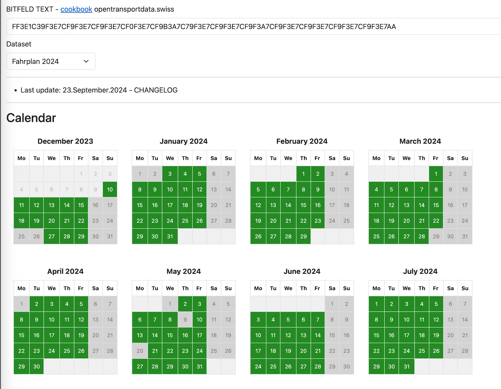

# Bitfeld visualizer

URL: https://tools.opentransportdata.swiss/bitfeld-viz/

This webapplication builds visualization for [HRDF Bitfeld](https://opentransportdata.swiss/de/cookbook/timetable-cookbook/hafas-rohdaten-format-hrdf/#BITFELD) strings.



See [CHANGELOG](./CHANGELOG.md) for latest changes.

## Formats

| Format | Example | Link |
|-|-|-|
| [HRDF Bitfeld](https://opentransportdata.swiss/de/cookbook/timetable-cookbook/hafas-rohdaten-format-hrdf/#BITFELD) | `DF3E1C39F3E7CF9F3E7CF` ... | [example](https://tools.opentransportdata.swiss/bitfeld-viz/?bitfeld=DF3E1C39F3E7CF9F3E7CF9F3E7CF0F3E7CF9B3A7C79F3E7CF9F3E7CF9F3A7CF9F3E7CF9F307CF9F3E7CF9F3E7CF9F600) |
| raw bit (`0`, `1`) string | `101010101010101010101` ... | [example](https://tools.opentransportdata.swiss/bitfeld-viz/?bitfeld=1010101010101010101010101010101010101010101010101010101010101010101010101010101010101010101010101010) |

## Development server

The project was generated with [Angular CLI](https://github.com/angular/angular-cli) version 16.2.4.

```
$ npm install
$ ng serve

# navigate to http://localhost:4200/
```
