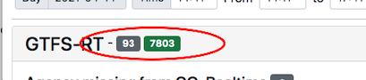
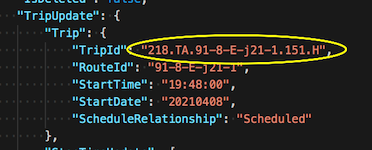
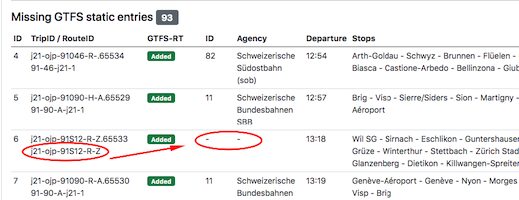
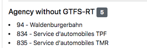
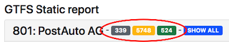
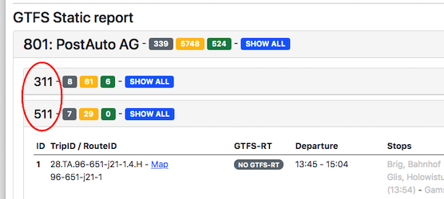

# GTFS-RT -static Comparison Process

## General
- the app is deployed here: https://opentdatach.github.io/gtfs-rt-status/

----

## Workflow

Step1. Fetching data
- the app fetch the GTFS-static resources (agencies, routes, stops) and stores to be looked-up later.
- for the trips we're fetching the trips for the given [-30min ... +3h] interval using the [Active Trips gtfs-query](https://github.com/openTdataCH/OJP-Showcase/tree/develop/apps/gtfs-query#active-trips) API. Only the [GO-Realtime](https://github.com/openTdataCH/OJP-Showcase/blob/develop/tools/_shared/inc/config/go-realtime.csv) agencies are used.
- the app retreives the latest [GTFS-RT](https://opentransportdata.swiss/de/cookbook/gtfs-rt/) data.

Step2. GTFS-RT stats

- for each `Entity.$0.TripUpdate.Trip.TripId` we're checking if there is a GTFS-static `trip_id` equivalent.
-  gray badges numbers are for total **not matched** trips.
-  green badges numbers stands for all GTFS-static matched trips.

Step2. Evaluate GTFS-RT without GTFS-static

- for the entries without GTFS-static we're using the GTFS-RT `Trip.RouteId` against the `GTFS.routes` table. 

- for the matched routes we're checking if the `GTFS.routes.agency_id` belongs to the GO-Realtime dataset. If not then it will be reported under `Agency missing from GO-Realtime` section.
- the not-matched routes are having `j21-ojp-*`-like `GTFS_RT.RouteId` that cant be matched
- the missing entries are shown in a table and the entries are capped to top-100, everyting above indicates that there is an issue with the matching that needs further investigtions.

- the script also checks if there are GO-Realtime agency_id which don't have any GTFS-RT entries and they are listed for further checking.

Step3. Generate a report for each agency.

- `NOW` is the current moment in time. GTFS-static trips are selected for each agency for a window of [-30min ... +3h]
- the trips that finished (have `GTFS.trips.arrival_datetime` < `NOW`) are discarded
- the trips that are starting in the future (have `GTFS.trips.departure_datetime` > `NOW`) are flagged as `future`. 
- the trips are matched against GTFS-RT and displayed using the following color-scheme
  -  gray - counter for **active** trips with **no GTFS-RT** matches
  -  orange - counter for **future** trips with **no GTFS-RT** matches
  -  green - counter for **GTFS-RT matches**

- by default the report shows only the  **active trips with no GTFS-RT matches**
- an active trip is a trip which has `GTFS.trips.departure_datetime` < `NOW` **AND** `GTFS.trips.arrival_datetime` > `NOW`
- the other trips (future and matched GTFS-RT trips) can be also shown by toggling the `SHOW ALL` button
- the  orange future trips contains only trips that don't have GTFS-RT, the future ones that have GTFS-RT are already counted inside the  green category.
- so for the exmple above we have
  -  339 **active** trips that don't have GTFS-RT entries
  -  5748 **future** trips that don't have GTFS-RT entries
  -  524 **active + future** trips that have GTFS-RT entries
- the trips are also grouped-by using `GTFS.routes.route_short_name` for a more granular lookup.

- the agencies are sorted descending by the numbers of issues.
- the estimated position of each active service can be visualized by clicking the `Map` link.

----

## Data Sources

### 1. GO-Realtime List

We're using [opentransportdata.swiss go-realtime](https://opentransportdata.swiss/de/dataset/go-realtime) to fetch the latest version. The Excel is exported and saved as CSV in [config/go-realtime.csv](https://github.com/openTdataCH/OJP-Showcase/blob/develop/tools/_shared/inc/config/go-realtime.csv).

### 2. GTFS-static

The following API is used for APIs are used for fetching GTFS-static info
[./apps/gtfs-query](https://github.com/openTdataCH/OJP-Showcase/tree/develop/apps/gtfs-query)

### 3. GTFS-RT

We're using [opentransportdata.swiss GTFS Realtime](https://opentransportdata.swiss/de/cookbook/gtfs-rt/) endpoint: `https://api.opentransportdata.swiss/gtfsrt2020`

----

Created: 14.April 2021

Updated: 03.November 2021