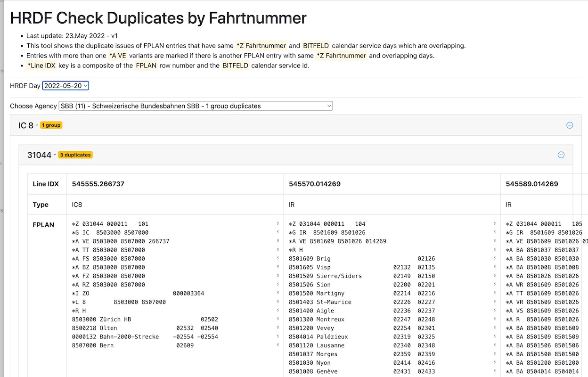

# HRDF Check Duplicates

Demo: https://tools.odpch.ch/hrdf-check-duplicates/

Issue: [Prüfung auf doppelte Fahrten](https://github.com/openTdataCH/OJP-Showcase/issues/8)

## Installation

`$ npm install`

## Serve locally

`npm run tscw & npm run buildw`