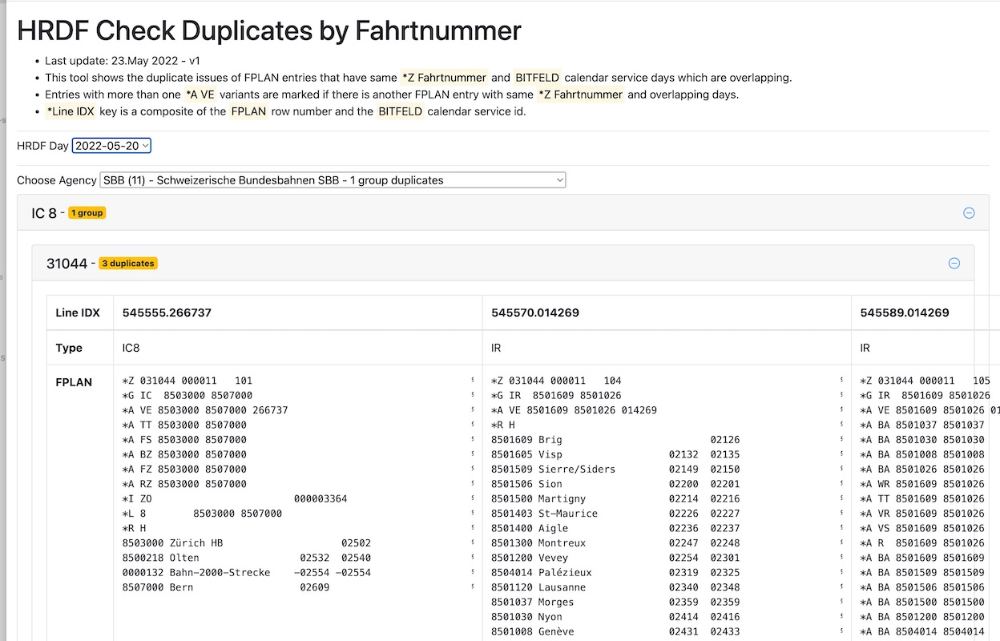

# HRDF Duplicates Report

Demo: https://tools.odpch.ch/hrdf-check-duplicates/

Issue: [Prüfung auf doppelte Fahrten](https://github.com/openTdataCH/OJP-Showcase/issues/8)

## Installation

- checkout this repo
- `$ cd ./apps/hrdf-duplicates-report`
- `npm install`
- `ng serve`

Navigate to `http://localhost:4200/`. The application will automatically reload if you change any of the source files.

This project was generated with [Angular CLI](https://github.com/angular/angular-cli) version 14.0.6.

