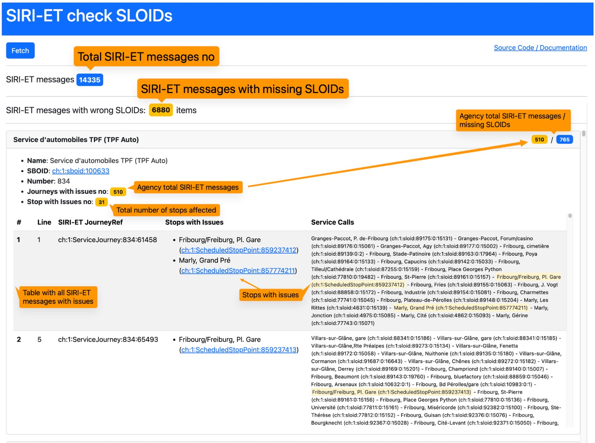

# SIRI-ET check SLOIDs webapp

This is an Angular webapp that is checking [SIRI-ET](https://opentransportdata.swiss/en/cookbook/siri-et-pt-with-request-response/) messages for missing [SLOIDs](https://www.oev-info.ch/de/datenmanagement/sid4pt-swiss-id-public-transport/swiss-location-identification-sloid).

Demo URL: https://tools.odpch.ch/siri-et-check-sloids/



## Install

```
$ cd /path/siri-et-compare-gtfs-rt
$ npm install

# local development http://localhost:4200/
$ ng serve
```

## DataSources

| Dataset | URL | Description |
|-|-|-|
| Business Organisations | [actual_date_business_organisation_versions_LATEST.csv](https://tools.odpch.ch/data/actual_date_business_organisation_versions_LATEST.csv) | This API gives the latest `actual_date_business_organisation_versions*` CSV file from [business-organisations](https://data.opentransportdata.swiss/en/dataset/business-organisations) |
| SIRI-ET feed | https://api.opentransportdata.swiss/siri-et | SIRI-ET latest response - see [SIRI-ET cookbook](https://opentransportdata.swiss/en/cookbook/siri-et-pt-with-request-response/) | 

## Methodology

- the validation is done for each `<EstimatedVehicleJourney>` message
- the `<EstimatedCalls>/<EstimatedCall>`, `<RecordedCalls>/<RecordedCall>` nodes are checked for missing SLOIDs

## Steps
- loop through all SIRI-ET messages
- for each message check each estimated/recorded call node. 
- mark the trip as with issue if:
  - `<StopPointRef>` starts with `85..`
  - `<StopPointRef>` starts with `ch:1:ScheduledStopPoint:85`

```
<EstimatedCall>
    <StopPointRef>ch:1:ScheduledStopPoint:858098201</StopPointRef>
    <VisitNumber>18</VisitNumber>
    <StopPointName>Gordola, Gnesa</StopPointName>
    ....
</EstimatedCall>
```

- group the affected StopPointRef based on the DIDOK number
- group the affected SIRI-ET messages by business organisation
- sort the agency groups showing on top the agency with most number of affected messages 

## Figures

at 12.March 2025

- there were more than 14'000 SIRI-ET messages
- 6'880 messages have issues - 47%

