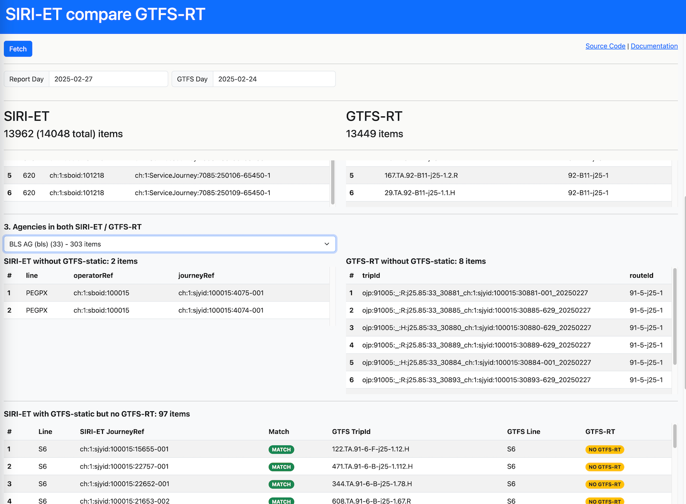
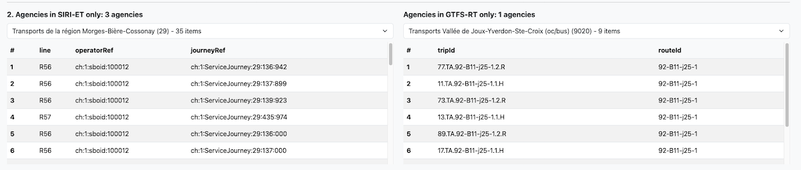
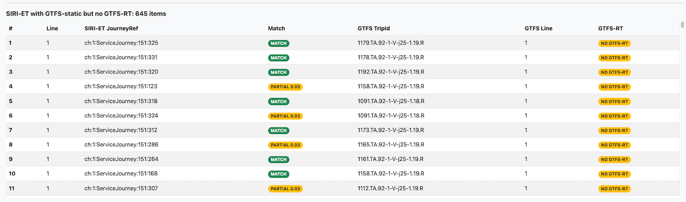
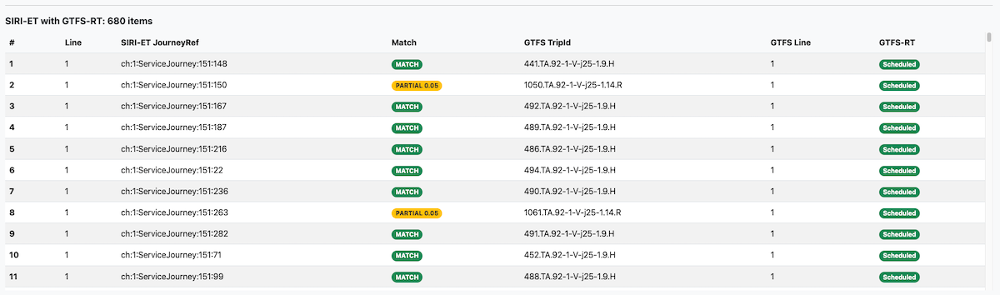
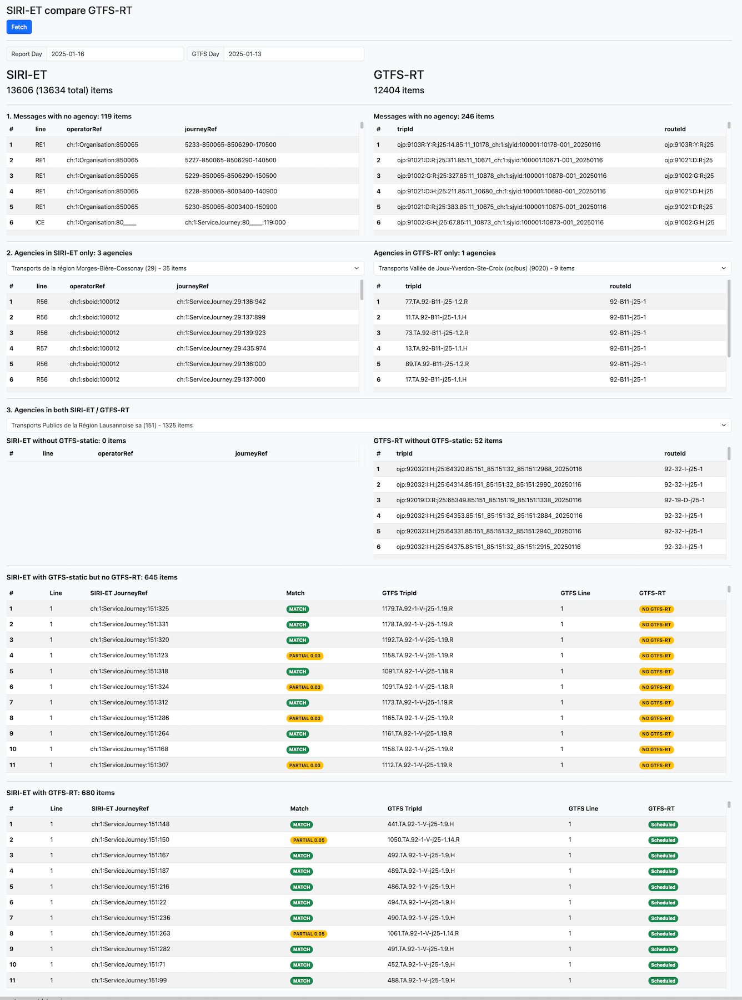

# SIRI-ET compare with GTFS-RT webapp

This is an Angular webapp that is comparing [SIRI-ET](https://opentransportdata.swiss/en/cookbook/siri-et-pt-with-request-response/) dataset with [GTFS-RT](https://opentransportdata.swiss/en/cookbook/gtfs-sa/) feed.

Demo URL: https://tools.odpch.ch/siri-et-compare-gtfs/



## Install

```
$ cd /path/siri-et-compare-gtfs-rt
$ npm install

# local development http://localhost:4200/
$ ng serve
```

## DataSources

| Dataset | URL | Description |
|-|-|-|
| GTFS-static DBs catalog | https://tools.odpch.ch/gtfs-static-dbs/gtfs-static-dbs.json | Metadata info about latest GTFS catalog. This file is produced 2x/week by the [gtfs-static-db-importer](https://github.com/openTdataCH/OJP-Showcase/tree/develop/tools/gtfs-static-db-importer) tool |
| Business Organisations | [actual_date_business_organisation_versions_LATEST.csv](https://tools.odpch.ch/data/actual_date_business_organisation_versions_LATEST.csv) | This API gives the latest `actual_date_business_organisation_versions*` CSV file from [business-organisations](https://data.opentransportdata.swiss/en/dataset/business-organisations) |
| SIRI-ET feed | https://api.opentransportdata.swiss/siri-et | SIRI-ET latest response - see [SIRI-ET cookbook](https://opentransportdata.swiss/en/cookbook/siri-et-pt-with-request-response/) | 
| GTFS-RT feed | https://api.opentransportdata.swiss/gtfsrt2020 | GTFS-RT latest response - see [GTFS-RT cookbook](https://opentransportdata.swiss/en/cookbook/gtfs-rt/) | 
| GTFS-DB lookups | [./gtfs-query/db_lookups?gtfs_day=YYYY-MM-DD](https://tools.odpch.ch/gtfs-rt-status/api/gtfs-query/db_lookups?gtfs_day=2025-01-13) | GTFS DB lookups for: `agency`, `routes`, `stops` tables via [gtfs-query](https://github.com/openTdataCH/OJP-Showcase/tree/develop/apps/gtfs-query) app |

For each agency, additional requests are made to obtain full `trips`, `stop_times` information

| Dataset | URL | Description |
|-|-|-|
| GTFS-DB `trips` lookups | [./gtfs-query/db_lookups?gtfs_day=YYYY-MM-DD&service_day=YYYY-MM-DD&agency_id=AGENCY_ID](https://tools.odpch.ch/gtfs-rt-status/api/gtfs-query/trips?gtfs_day=2025-01-13&service_day=2025-01-16&agency_id=801) | GTFS DB full information for `trips`, `stop_times` of a given `AGENCY_ID` in a given `service_day` operation day. The results are provided by [gtfs-query](https://github.com/openTdataCH/OJP-Showcase/tree/develop/apps/gtfs-query) app |

## Methodology

- the comparison is based on intersection between `SIRI-ET` - `GTFS-static` - `GTFS-RT` datasets 
- the matching is done at the level of `trips.trip_id` or pairs of `stop_id`+`arr/dep` times from `stop_times` tables

## Steps
- group messages by GTFS agency
  - for each SIRI-ET message, the `OperatorRef` value is converted to GTFS `agency_id` equivalent using [business-organisations](https://data.opentransportdata.swiss/en/dataset/business-organisations)
  - for each GTFS-RT message, the `RouteId` value is looked up against current GTFS-static dataset and `routes.agency_id` is used to group the messages on agencies 
- first section of the report contains messages in SIRI-ET and GTFS-RT that a GTFS `agency_id` couldnt be found


(these messages can be also be fuzzy-matched using just stop_times (calls in SIRI-ET), see NextSteps below

- 2nd section shows reports agencies that are only in SIRI-ET or only in GTFS-RT feeds



- 3rd part of the report intersects the SIRI-ET feed messages based on the GTFS static `trips`, `stop_times`
- for matching 2 indexes are used
  - a smaller index based on agency SIRI-ET messages grouped by `<PublishedLineNumber>`
  - a larger index with all messages / trips for each agency
- the index key is built on `stop_id - arr_time', `stop_id - dep_time' pairs. Each stop_id is normalised and converted to DIDOK, 7-digits equivalent and platform data is stripped out.
- the match between SIRI-ET message - GTFS-trips can return:
  - full match, 100%, `stop_times` exact match 
  - partial match, wher at least 2 key-pair values should be matched
- reports the SIRI-ET, GTFS-RT trips with agency but no GTFS-static trip_id match


(these messages can be also be fuzzy-matched using just stop_times (calls in SIRI-ET), see NextSteps below

- reports SIRI-ET messages with GTFS-static but no GTFS-RT match


- reports SIRI-ET messages with GTFS-static and also GTFS-RT match (ideal case)


- the `Match` column can have following values
  - `MATCH` for a full-key match, the stop_times matches 100%
  - `PARTIAL` and a score `[0..1]`, for ex 0.2 means 20% of the stop_times pairs were matched.

- for each agency the total number of SIRI-ET messages are a sum of:
  - messages without GTFS-static
  - messages with GTFS-static but no GTFS-RT
  - messages with GTFS-static and GTFS-RT

For example below
`1325 = 0 + 645 + 680`

## Full-report example



## Next Steps

- perform more fuzzy matching based on `stop_id`+`arr/dep` `stop_times` pairs for the rest of the not-matched messages
- debug display SIRI-ET and GTFS-RT original messages in the matching tables
